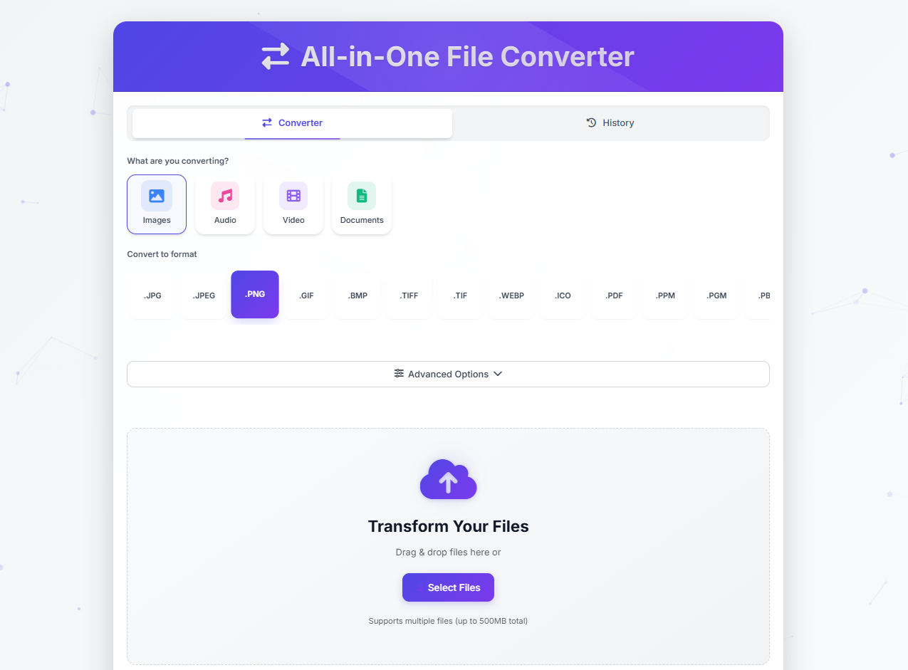

# All-in-One File Converter

A modern web application to convert files between various formats, completely free and running locally on your PC.


## Features

- 🖼️ Convert images between different formats (JPG, PNG, WebP, HEIC, etc.)
- 🎛️ Advanced options for image manipulation (resize, rotate, filters)
- 🎵 Convert audio files with advanced settings
- 🎬 Support for video conversion with multiple settings
- 📄 Convert documents between various formats (PDF, DOCX, TXT, HTML, MD, etc.)
- 📦 Process multiple files simultaneously
- 🚀 Parallel processing for faster conversions
- 🔄 Drag-and-drop interface
- 💾 Download individual files or all as a ZIP
- 🛡️ 100% local processing - no data is uploaded to external servers
- 🆓 Completely free and open source


## Requirements

- Python 3.7 or higher
- pip (Python package installer)
- FFmpeg (for audio/video conversions)
- Pandoc (optional, for advanced document conversions)


## Installation

1. Clone or download this repository to your local machine.

2. Navigate to the project directory in your terminal:

   ```
   cd all_in_one_converter
   ```

3. Install the required dependencies:

   ```
   pip install -r requirements.txt
   ```

4. Install FFmpeg (required for audio/video conversions):
   - Windows: Download from https://ffmpeg.org/download.html and add it to your PATH
   - macOS: `brew install ffmpeg`
   - Linux: `apt install ffmpeg` or `yum install ffmpeg`

5. Install Pandoc (optional, for advanced document conversions):
   - Windows: Download from https://pandoc.org/installing.html
   - macOS: `brew install pandoc`
   - Linux: `apt install pandoc` o `yum install pandoc`


## HOW TO USE

1. Start the application:

   ```
   python app.py
   ```

2. Open your web browser and go to:

   ```
   http://localhost:5000
   ```

3. Use the application:
   - Drag and drop files into the drop area or click "Select Files"
   - Choose the desired conversion and manipulation options
   - Click "Convert" to process the files
   - Download the converted files individually or click "Download All as ZIP"


## How It Works

The application uses the following technologies:

- Flask: A lightweight web framework for Python
- Pillow/PIL: Python Imaging Library for image processing
- pillow-heif: A plugin for Pillow to handle HEIC/HEIF images
- FFmpeg: For audio and video conversions
- PyPDF2, python-docx, and other libraries for document handling
- Pandoc: For advanced document format conversions
- ThreadPoolExecutor: For parallel file processing


## Supported Formats

### Images
- Input: jpg, jpeg, png, gif, bmp, tiff, tif, webp, heic, heif, ico, ppm, pgm, pbm, pnm, avif
- Output: jpg, jpeg, png, gif, bmp, tiff, tif, webp, ico, pdf, ppm, pgm, pbm, pnm

### Audio
- Input: mp3, wav, ogg, flac, aac, m4a, wma, aiff, alac, opus, ac3, amr
- Output: mp3, wav, ogg, flac, aac, m4a, opus

### Video
- Input: mp4, avi, mov, wmv, flv, mkv, webm, m4v, mpeg, mpg, 3gp, vob, ogv, mts, m2ts
- Output: mp4, avi, mov, mkv, webm, gif, mp3, ogg

### Documents
- Input: pdf, doc, docx, odt, txt, rtf, html, htm, md, markdown, csv, json, xml, epub, tex, rst, adoc
- Output: pdf, docx, odt, txt, rtf, html, md, markdown, csv, json, epub, tex, rst, adoc


## License

This project is open source, use it how you want to.


## Screenshot




## Troubleshooting

- If you encounter "libheif not found" errors, you may need to install libheif:
  - Windows: Use the precompiled binaries provided with pillow-heif
  - macOS: `brew install libheif`
  - Linux: `apt-get install libheif-dev` o `yum install libheif-devel`

- For document conversions:
  - Ensure Pandoc is installed and in the PATH for advanced conversions
  - For issues with password-protected PDFs, verify the entered password is correct
  - Some formats may require additional libraries; check the console for specific error messages

- If files are not converting, ensure they are valid and supported formats.